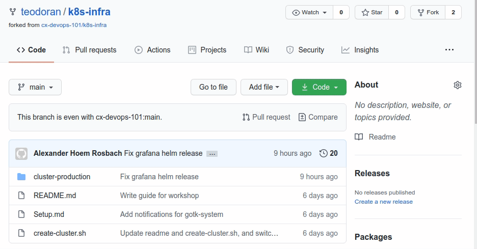
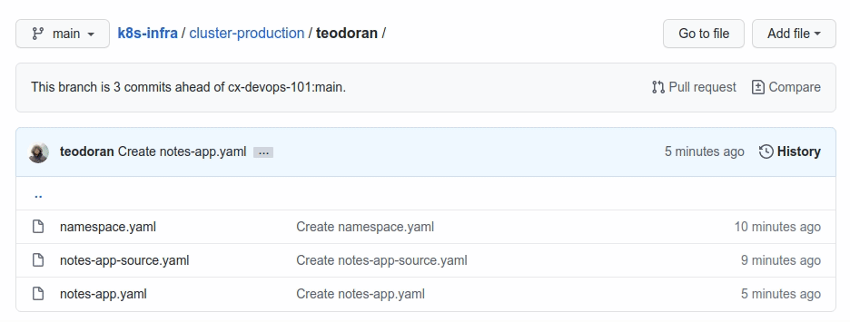

# k8s-infra
This repository contains the Kubernetes Cluster Manifests for the Computas DevOps 101 workshop. This readme is for the
workshop participants, if you are an instructor and need the Setup instructions see [here](Setup.md).

## Step 5: Forked it, now what?
So far you've created your own application repository, added CI workflows that automatically build and push your
container images, declared how you want your application to be deployed, and you've forked this repository. The reason
you forked this repository is that you want to propose a change to the [cx-devops-101/k8s-infra](https://github.com/cx-devops-101/k8s-infra)
repository, where you tell the GitOps operator about your application's workload manifests. In stark opposite from before,
this time we actually do want the pull-requests to be merged back into the original repository, i.e.
[cx-devops-101/k8s-infra](https://github.com/cx-devops-101/k8s-infra), so make a mental note of that. Let's begin adding
our new application to the cluster.

## Step 6: Declare application
The declaration of our application will consist of a new directory with three files:
1. `<github-username>/namespace.yaml`: In this file we declare the namespace that we want to deploy our application into.
1. `<github-username>/notes-app-source.yaml`: In this file we tell the GitOps operator about our application repository.
1. `<github-username>/notes-app.yaml`: In this file we tell the GitOps operator where to find the kubernetes workload manifests for our application in the repository we told it about in the previous file.

Adding new files to a new directory through the GitHub website is a bit more difficult to explain in text but we'll try
our best, though hopefully the instructors has already shown you how. First off, navigate to the [cluster-production](cluster-production)
directory. Before we continue, open the [notes-app](cluster-production/notes-app) in a new browser tab, you'll need it later.

### namespace.yaml
1. Click on `Add file` in the upper-right corner of the file view.
1. Then click on `Create new file`.
1. You should be redirected to a text-editor where you'll see a `Name your file...` text input.
1. Type in `<github-username>/namespace.yaml`. When you've added the `/` the UI will make it clear that it understands that you want to put the file in a directory named `<github-username>`.
1. Open [notes-app/namespace.yaml](cluster-production/notes-app/namespace.yaml) in a new tab, and copy the file contents.
1. Paste the contents into your new file.
1. Replace `name: notes-app` with `name: <github-username>`.
1. Commit the file directly to the `main`-branch.

### notes-app-source.yaml
1. Navigate to the `<github-username>` directory you added when you created `namespace.yaml`.
1. Then click on `Create new file`.
1. Enter `notes-app-source.yaml` as the filename.
1. Open [notes-app/notes-app-source.yaml](cluster-production/notes-app/notes-app-source.yaml) in a new tab, and copy the file contents.
1. Paste the contents into your new file.
1. Replace `name: notes-app` with `name: <github-username>`.
1. Replace `branch: production` with `branch: master`.
1. Replace `https://github.com/cx-devops-101/notes-app` with the url to your notes-app repository, e.g. `https://github.com/<github-username>/notes-app`.
1. Commit the file directly to the `main`-branch.

### notes-app.yaml
1. Navigate to the `<github-username>` directory you added when you created `namespace.yaml`.
1. Then click on `Create new file`.
1. Enter `notes-app.yaml` as the filename.
1. Open [notes-app/notes-app.yaml](cluster-production/notes-app/notes-app.yaml) in a new tab, and copy the file contents.
1. Paste the contents into your new file.
1. Replace both instances of `name: notes-app` with `name: <github-username>`.
1. Replace `targetNamespace: notes-app` with `targetNamespace: <github-username>`
1. Commit the file directly to the `main`-branch.

## Step 7: Pull request
At this point you should have added some new files to your fork of [cx-devops-101/k8s-infra](https://github.com/cx-devops-101/k8s-infra),
and you should be ready to create a pull request back to the source repository. Navigate back to the root of your repository. You should
see a grey box where it says `This branch is 3 commits ahead of cx-devops-101:main.` with a `Pull request` link to the right, click on it.
You should be redirected to a page with the title `Comparing changes`, and you should see the following at the top:
1. `base repository: cx-devops-101/k8s-infra` and `base: main`
1. `head repository: <github-username>/k8s-infra` and `compare: main`
1. `Able to merge`

If all that seems to match up, then go ahead and create the pull request. A maintainer of [cx-devops-101/k8s-infra](https://github.com/cx-devops-101/k8s-infra)
will look at your pull request as soon as possible, and when it is merged your application should quickly be available at the domain
you declared in the igress.yaml in your `notes-app` repository, e.g. `http://<github-username>.devops.rosbach.no`.