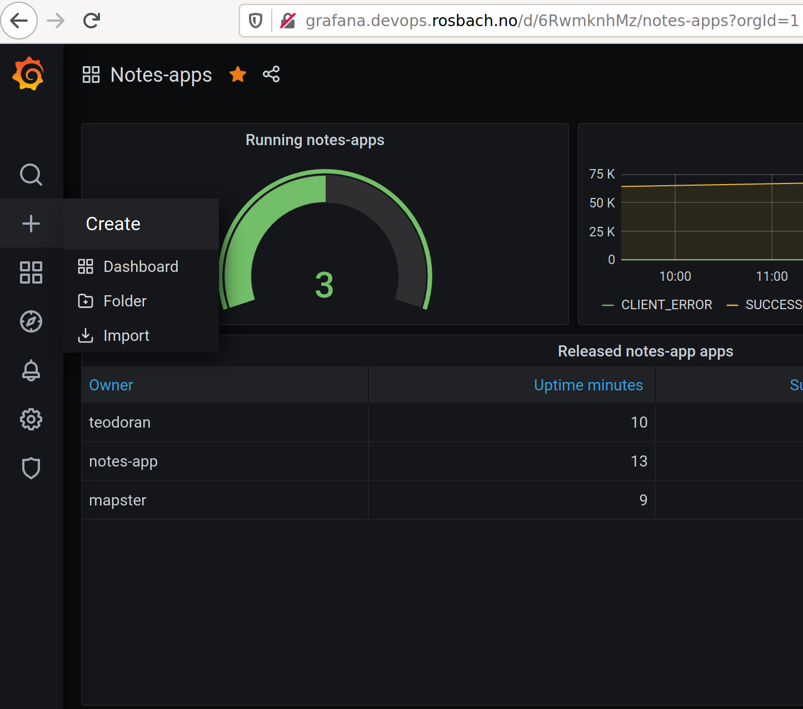
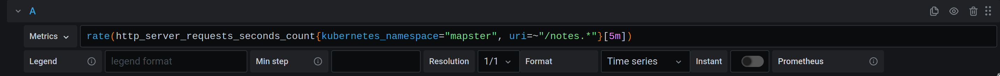

# k8s-infra
This repository contains the Kubernetes Cluster Manifests for the Computas DevOps 101 workshop. This readme is for the
workshop participants, if you are an instructor and need the Setup instructions see [here](Setup.md).

## Step 5: Forked it, now what?
So far you've created your own application repository, added CI workflows that automatically build and push your
container images, declared how you want your application to be deployed, and you've forked this repository. The reason
you forked this repository is that you want to propose a change to the [cx-devops-101/k8s-infra](https://github.com/cx-devops-101/k8s-infra)
repository, where you tell the GitOps operator about your application's workload manifests. In stark opposite from before,
this time we actually do want the pull-requests to be merged back into the original repository, i.e.
[cx-devops-101/k8s-infra](https://github.com/cx-devops-101/k8s-infra), so make a mental note of that. Let's begin adding
our new application to the cluster.

## Step 6: Declare application

The declaration of our application will consist of a new directory with three files:
1. `<github-username>/namespace.yaml`: In this file we declare the namespace that we want to deploy our application into.
1. `<github-username>/notes-app-source.yaml`: In this file we tell the GitOps operator about our application repository.
1. `<github-username>/notes-app.yaml`: In this file we tell the GitOps operator where to find the kubernetes workload manifests for our application in the repository we told it about in the previous file.

Adding new files to a new directory through the GitHub website is a bit more difficult to explain in text but we'll try
our best, though hopefully the instructors has already shown you how. First off, navigate to the [cluster-production](cluster-production)
directory. Before we continue, open the [notes-app](cluster-production/notes-app) in a new browser tab, you'll need it later.

### namespace.yaml
1. Click on `Add file` in the upper-right corner of the file view.
1. Then click on `Create new file`.
1. You should be redirected to a text-editor where you'll see a `Name your file...` text input.
1. Type in `<github-username>/namespace.yaml`. When you've added the `/` the UI will make it clear that it understands that you want to put the file in a directory named `<github-username>`.
1. Open [notes-app/namespace.yaml](cluster-production/notes-app/namespace.yaml) in a new tab, and copy the file contents.
1. Paste the contents into your new file.
1. Replace `name: notes-app` with `name: <github-username>`.
1. Commit the file directly to the `main`-branch.

### notes-app-source.yaml
1. Navigate to the `<github-username>` directory you added when you created `namespace.yaml`.
1. Then click on `Create new file`.
1. Enter `notes-app-source.yaml` as the filename.
1. Open [notes-app/notes-app-source.yaml](cluster-production/notes-app/notes-app-source.yaml) in a new tab, and copy the file contents.
1. Paste the contents into your new file.
1. Replace `name: notes-app` with `name: <github-username>`.
1. Replace `branch: production` with `branch: master`.
1. Replace `https://github.com/cx-devops-101/notes-app` with the url to your notes-app repository, e.g. `https://github.com/<github-username>/notes-app`.
1. Commit the file directly to the `main`-branch.

### notes-app.yaml
1. Navigate to the `<github-username>` directory you added when you created `namespace.yaml`.
1. Then click on `Create new file`.
1. Enter `notes-app.yaml` as the filename.
1. Open [notes-app/notes-app.yaml](cluster-production/notes-app/notes-app.yaml) in a new tab, and copy the file contents.
1. Paste the contents into your new file.
1. Replace both instances of `name: notes-app` with `name: <github-username>`.
1. Replace `targetNamespace: notes-app` with `targetNamespace: <github-username>`
1. Commit the file directly to the `main`-branch.

## Step 7: Pull request
At this point you should have added some new files to your fork of [cx-devops-101/k8s-infra](https://github.com/cx-devops-101/k8s-infra),
and you should be ready to create a pull request back to the source repository. Navigate back to the root of your repository. You should
see a grey box where it says `This branch is 3 commits ahead of cx-devops-101:main.` with a `Pull request` link to the right, click on it.
You should be redirected to a page with the title `Comparing changes`, and you should see the following at the top:
1. `base repository: cx-devops-101/k8s-infra` and `base: main`
1. `head repository: <github-username>/k8s-infra` and `compare: main`
1. `Able to merge`

If all that seems to match up, then go ahead and create the pull request. A maintainer of [cx-devops-101/k8s-infra](https://github.com/cx-devops-101/k8s-infra)
will look at your pull request as soon as possible, and when it is merged your application should quickly be available at the domain
you declared in the igress.yaml in your `notes-app` repository, e.g. `http://<github-username>.devops.rosbach.no`.

## Step 8: Monitoring

Monitoring of important metrics and logs is essential to successfully implement DevOps. Developers and other stakeholders must be able to observe the metrics in specialized dashboards, and receive notifications when certain metrics exceeds a defined threshold or if a failure switch has been triggered. Good
dashboards can provide developers with important insight into parameters such as performance, usage patterns, resource capacity, stability during peak hours
etc. There are many tools that one can use to set up monitoring with, and we will cover the basics of one such toolset, namely Grafana and Prometheus.
Grafana and Prometheus are very popular, and the go to solution for many Kubernetes DevOps-driven environments. We will not cover monitoring of logs in this
workshop.

We have already installed Prometheus and Grafana in the workshop Kubernetes cluster at [grafana.devops.rosbach.no](grafana.devops.rosbach.no). The workshop
instructors should already have provided you with the necessary credentials. The `notes-api` service exposes metrics to Prometheus using
[micrometer](micrometer.io), and the deployment manifest includes annotations that tell Prometheus where to scrape those metrics from.

## Create a Dashboard
It's time to create your very own insightful dashboard. We want our dashboard to show us the average number of requests per second in 5 minute windows.
To create the dashboard navigate to [grafana.devops.rosbach.no](http://grafana.devops.rosbach.no/), log in with the username "admin" (ask one of the workshop hosts for the super-secret password), click on the `+` button on the left-hand side, and then click on `Create`.

Then click on the `Add new panel` button.

Let's begin by declaring a simple query to verify that we're able to see some data. The page that you have in front of you now is divided into three
primary views: visualization of your panel (top), query declarations (bottom) and panel settings (right).

We want to start by entering the following PromQL (i.e Prometheus query) query into the "Metrics" text input named "A": `http_server_requests_seconds_count`.

This query will list every such timeseries in the entire kubernetes cluster. It's the `notes-api` application instances that produces these timeseries,
and every participant of this workshop will have deployed one.

We obviously have to filter our results so that we only get the timeseries for our application. Each of the `http_server_requests_seconds_count` timeseries
have labels attached to them, and we can add filtering to our query so that we only find the timeseries for your Kubernetes namespace. If you followed the
[instructions](https://github.com/cx-devops-101/k8s-infra#namespaceyaml) the name of the namespace will be your GitHub username, so replace
`<GitHub username>` in the following query and paste it into Grafana: `http_server_requests_seconds_count{kubernetes_namespace="<GitHub username"}`.

This will decrease the number of timeseries in the graph such that you only see the timeseries for your instance of the `notes-api` service (you might need to click outside the query input box to get the graph to update). But we're still
including more timeseries than we want to. Prometheus is scraping data about the health and metrics endpoints of `notes-api`, which really aren't very
interesting in our graph, since they will completely dominate it.

You may have noticed the warning `Metric http_server_requests_seconds_count is a counter.` as well, ignore that for now, we'll get back to it.

Let's add a filter to ignore the health and metrics requests by only including requests where the URI path starts with `/notes`. Add `, uri=~"/notes.*"` inside the curly-brackets.

We're getting closer. We want to include all the timeseries that we now see, but we don't want individual lines for each of them, we want to combine them
somehow, and we also want the average request per second in five minute windows. To achieve this we can use the `sum` and `rate` functions. The intuitive
way would be to sum first, and then do the averaging, but due to how the `rate` function works we need to apply it first.

Apply the `rate`-function to your query. Notice that we added `[5m]` as well.

We're almost there. We now have a graph with lines for each type of request that your `notes-api` has received, e.g. GET, PUT, POST, DELETE for `/notes`.
And these lines visualize the average requests per second in five minute windows.

Let's sum it all together so that we have one line that shows the total request no matter the HTTP Method or URL path, by applying the `sum`-function.

We have achieved our goal and you should see a nice graph that visualizes the request load over time. Put some pressure on your application by
creating, updating and deleting sticky notes to see how it works.

## Step 9: We need more panels!

Play around with Grafana and see if you can come up with some handy metrics to visualize.
